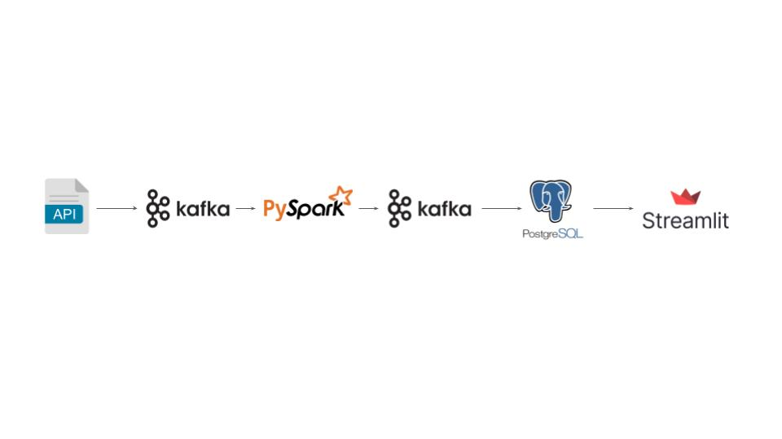

# 🚌 London Bus Tracker

Real-time data engineering pipeline for tracking London bus arrivals (Lines 12, 8, 73, 38, 25) using Transport for London (TfL) Unified API. 
The system processes live data streams and displays bus arrival estimates in minutes at upcoming stations via dashboard.


## Dashboard Overview

https://github.com/fadelaf/tfl-london-bus-tracker/blob/main/dashboard_tfl_recording.mp4

## Data Pipeline Architecture Overview



## Tech Stack
- Python
- Kafka
_ Pyspark
- PostgreSQL
- Streamlit
- Docker

## Data Source

- Transport For London (TLF) API
    API Endpoints Used: https://api.tfl.gov.uk/Line/{id}/Arrivals

## Features
- Data ingestion from TFL API every 30 second
- Kafka for data producers and consumers
- Stream processing and data transformation with PySpark
- Data storage in PostgreSQL
- Auto cleanup expired data
- Streamlit for bus tracker dashboard

## Dashboard features
- Live bus time arrival predictions

## Local Development

### clone repository
git clone https://github.com/fadelaf/tfl-london-bus-tracker

### create in environment file .env manually
<pre> ```bash DB_HOST=your_host 
DB_USER=your_user 
DB_PASS=your_passowrd 
API_ID='your API id' 
API_KEY='your API key' 
DB_MAIN='your db' 
BOOTSTRAP_SERVERS='localhost:29092' #for kafka 
JAVA_HOME_PATH = "/Library/Java/JavaVirtualMachines/jdk-17.jdk/Contents/Home"  #for connect to java virtual machine 
SPARK_CONFIG_LOCAL= "your-path/postgresql-42.7.3.jar" # for postgresql jar ```</pre>

### start services 
docker-compose up -d --build

### access dashboard
http://localhost:8501

### Acknowledgments
- Transport for London (TFL) API
- Kafka and Pyspark
- Docker for containerization tools

## Contact
Fadel - fadelahmadf@gmail.com